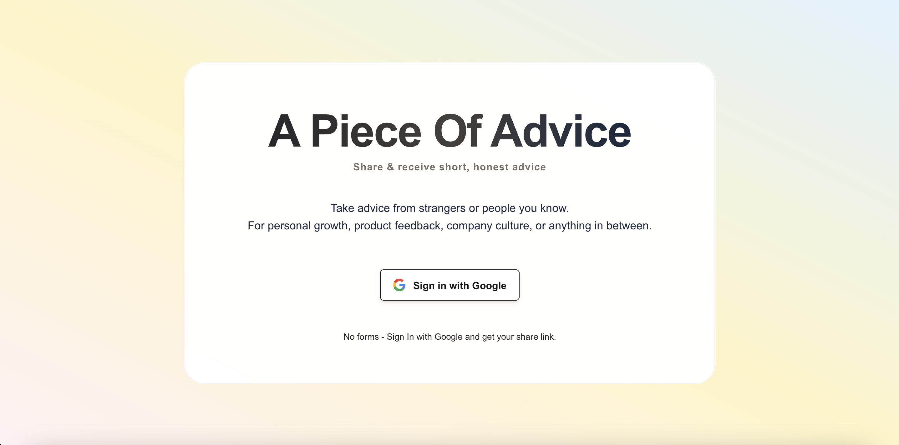
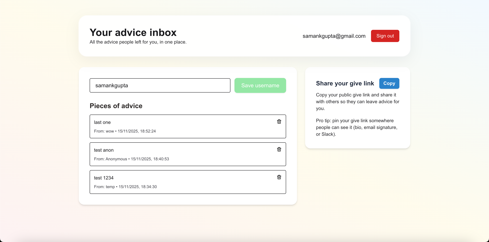
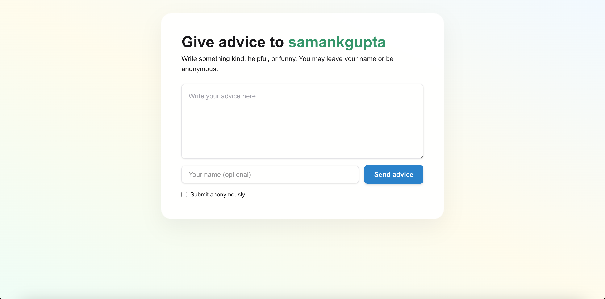

# A Piece Of Advice



Lightweight Next.js app (App Router) + Supabase for auth + Postgres. People can send short pieces of advice to each other via a per-user public give link: `/give/<username>`. The app includes a small dashboard, per-advice delete for owners, and server-authoritative writes for security.





## Quick start (developer)

1. Add supabase env vars into `.env.local`:

2. Install and run locally:

```bash
npm install
npm run dev
```

3. Sign in (Google) and open your dashboard to see incoming advice.

## Project overview

- Framework: Next.js (App Router), React, TypeScript
- UI: Tailwind CSS
- Auth & DB: Supabase (Auth + Postgres)


## License

This project is open-source under the **MIT License**.

[](https://opensource.org/licenses/MIT)
